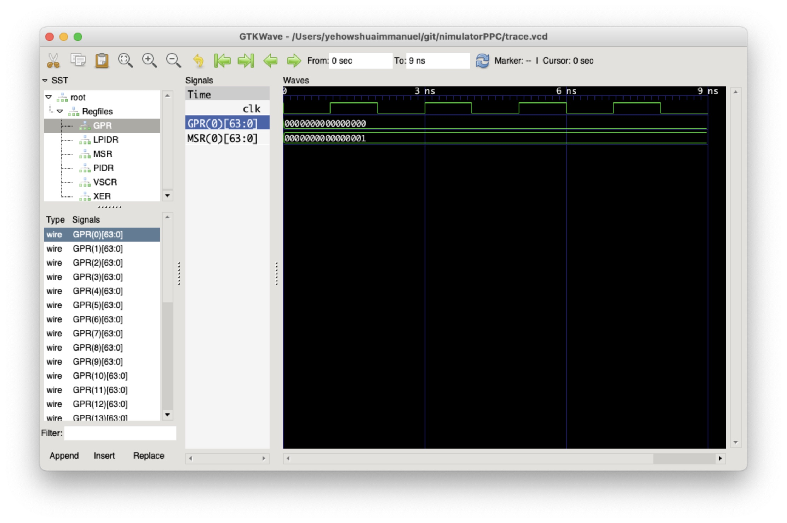

# nimulatorPPC

POWER9 emulator in Nim implementing the ISA as specified in 
[this document](https://ibm.ent.box.com/s/1hzcwkwf8rbju5h9iyf44wm94amnlcrv).

This simulator is designed such that it is easy to understand and follow.
The hope is that by studying it, the motivated individual should be able
to confidently design a POWER CPU in an HDL or RTL of their choice.

The simulator is also moderately fast, executing up to 2.5M+ instructions
per second if compiled with lots of nice optimizations(on apple silicon
at least):

# Running and Getting Started

You'll need to have [nim](https://nim-lang.org/)
installed.

Installing Nim from [source](https://github.com/nim-lang/Nim)
is also pretty easy.

## Setting Your Config
if you want to run the loopback example, you'll need to change the contents of
``config.json`` to the following:

```js
{
        "firmware"      : "resources/loopback_asm/firmware.bin",
        "ram_size"      : 16,
        "little_endian" : true
}
```

## Building the Firmware
You'll also need to build the binary firmware from source.

```bash
pushd resources/loopback_asm/
make
popd
```

## Run With No Optimizations

```bash
nim c -r src/nimulatorPPC.nim
```

## Optimizations if you use Clang

```bash
nim c -d:release --passC:-flto --passL:-flto -r src/nimulatorPPC
```

## Optimizations if you us GCC
```bash
nim c -d:release -d:lto -r src/nimulatorPPC
```

Press ``ctrl+c`` to end a simulation. At the end of sim, you should
get some stats such as :

``SIMULATED FOR 9249776 CYCLES AT ROUGHLY 2583931 CYCLES PER SECOND``

# Status 
Simple incrementing loopback working. I.E., you type 'a' and you get
back 'b'.

 - [x] full decoder with field select for all mnemonics
 - [ ] support for virtual memory(hopefully to be added in early July).

Supported instructions listed in 
[docs/supported_instructions.md](docs/supported_instructions.md).

# Getting Started
## Dependencies
 - gcc-powerpc64le-linux-gnu
 - [nim](https://nim-lang.org/install.html)
 - (optional) [qemu](https://wiki.qemu.org/Documentation/Platforms/PowerPC)
```bash
apt-get update && apt-get install -y gcc-powerpc64le-linux-gnu make nim
```

## Running
Modify ``config.json`` with desired simulator configuration.

```bash
git clone https://github.com/BracketMaster/nimulatorPPC
cd nimulatorPPC
pushd resources/loopback
make
popd
nimble install print itertools
nim c -r src/nimulatorPPC.nim
```

## Running With Debug Mode

You can also simulate the CPU with a debug mode that dumps CPU
state to a value change dump(VCD) file. You can view VCD files
with software such as [GTKWave](http://gtkwave.sourceforge.net/).

The default location the waveform gets dumped to is ``./trace.vcd``.

```
nim c  -d:itrace -r src/nimulatorPPC.nim
```




## Verifying with Qemu
The generated firmware should also work in Qemu

```
qemu-system-ppc64 -M powernv -cpu POWER9 -nographic -bios resources/loopback_asm/firmware.bin
```

# Design

[See Architectural Design Here](docs/rendered/architecture.pdf)

The architecture of this simulator is very simple at the moment.
We fetch an instruction, determine its associated mnemonic, and finally
execute that instruction. This loop repeats until the simulator is 
terminated.

# Adding a New Instruction

See [adding a new instruction](docs/adding_a_new_instruction.md) for more
details.

# TODO

 - [ ] populate .gitignore with all binaries to possibly be generated
 - [x] working preliminary instruction dump trace to VCD
 - [ ] opcode names in waveform
 - [ ] proper support for endian change in instruction fetch
 - [ ] go through and add docs to sources
 - [x] make opcode error message red
 - [x] get mvp loopback going in QEMU
 - [x] use QEMU + gdb to figure out what is wrong
 - [x] dockerfile
 - [x] read binaries
 - [x] pass path argument
 - [x] support bi-endian reads
 - [x] MnemonicEnum -> bitPat
 - [x] MnemonicEnum -> FormEnum
 - [x] start decoding
    - [x] use xor for pattern matching(should work?)
    - [x] test endianness with decode
 - [x] FormEnum -> FieldSelect
 - [ ] Add list of supported instructions
 - [ ] Add sane debug and logging facilities
 - [x] support bi-endian writes
 - [x] convert from seq to arr
 - [x] replace bitslice with use non-mutating bitsliced
 - [x] determine whether or not binary fits in memory
 - [x] rework loadMemory to take a file
 - [x] reword loadMemory to have docs
 - [x] add docs to repository
 - [ ] support quad reads
 - [ ] find pages in POWER manual with info on register 
 - [ ] move debug to VCD
 - [ ] cast to int64 for BiggestInt

# Edge Cases

 - [ ] mvtspr needs to redirect when it hits a dedicated special SPR
 such as XER for example
 - [ ] does CRO:3 need to be preserved across instructions that do compares
 for example but can't have overflows by definition?